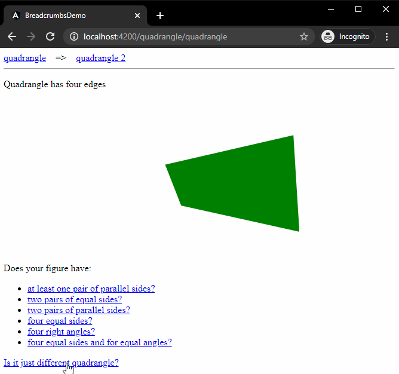

# Breadcrumbs

## Table of contents
* [General info](#general-info)
* [Technologies](#technologies)
* [Setup](#setup)
* [How it works](#how-it-works)

## General info
This project is simple realization of breadcrumbs.


	
## Technologies
Project is created with:
* Angular: 10.0.1
	
## Setup
To run this project, install all necessary packages and after that just run app:

```
$ npm install
$ ng serve
```

## How it works

All logic responsible for realization of breadcrumbs is located in [breadcrumbs.service.ts](https://github.com/bugdevourer/Breadcrumbs/blob/main/BreadCrumbsDemo/src/app/breadcrumbs-logic/breadcrumbs.service.ts). It is possible to read property ```data``` from the ```Router```. Data read in this way can be stored together with urls to which they refer in the form of breadcrumbs:
```
export class Breadcrumb {
    constructor(
        public label: string,
        public url: string
    ) { }
}
```

Note: ```breadcrumbs.service.ts``` contain method ```getLabelWithEnumerator``` that adds ordinal numbers to all repeating breadcrumbs
